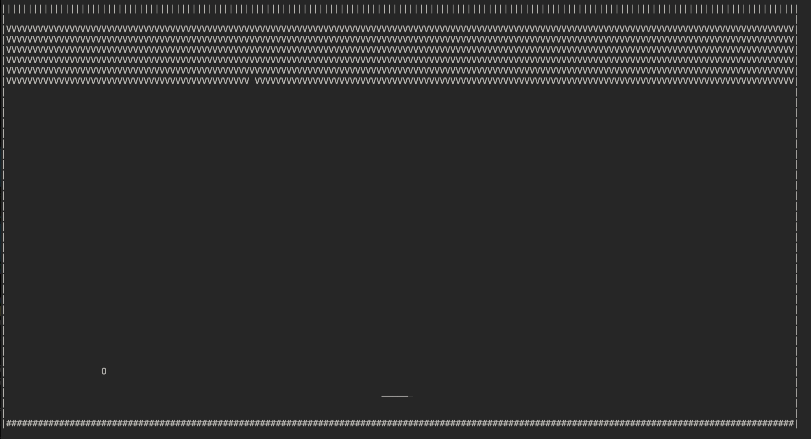

# Rust-Cli-Breakout
A basic rust implementation of breakout, in a cli.

## Warning
If it seems like the wall collision isn't working, it is because you cli is too small, you can turn down width of the game in main.rs, adjusting the constant "WIDTH" and compiling it with "cargo build". Currently the screen is 150 characters wide.

## Controls
You use 'a' and 'd' to move left and right.
